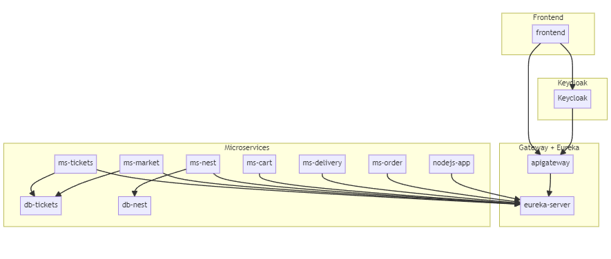

# System Architecture Documentation

This document outlines the distributed system architecture of our application stack. The setup is orchestrated using Docker Compose and is segregated into four primary clusters:

1. **Frontend Cluster**
2. **Gateway + Eureka Cluster**
3. **Keycloak Cluster**
4. **Microservices Cluster**

## 1. Frontend Cluster

The frontend cluster comprises a single service:

- **Frontend**: Hosted on port 3000, it interacts with the backend through the API Gateway and is authenticated via Keycloak.

## 2. Gateway + Eureka Cluster

This cluster facilitates the routing and service discovery within the system:

- **API Gateway**: Routed on port 8081, it acts as the entry point for backend requests and performs the necessary forwarding to respective microservices.
- **Eureka Server**: Running on port 8761, it facilitates service registration and discovery for the microservices.

## 3. Keycloak Cluster

- **Keycloak**: Hosted externally, it handles authentication and authorization for the frontend and the backend.

## 4. Microservices Cluster

The Microservices cluster houses the core business logic and data handling services of the application:

- **Database Services**:
  - **db-tickets**: MySQL service on port 3308.
  - **db-nest**: MongoDB service on port 27019.

- **Business Logic Microservices**:
  - **ms-tickets**: Ticket handling service on port 8089.
  - **ms-market**: Market service on port 8082.
  - **ms-cart**: Cart service on port 8086.
  - **ms-delivery**: Delivery service on port 8088.
  - **ms-order**: Order service on port 9001.
  
- **Utility Services**:
  - **ms-nest**: Sale-Safari API on port 4747.
  - **nodejs-app**: Node.js application on port 4000.

Each of these microservices registers with the Eureka server for service discovery and routes through the API Gateway for external and internal requests. The `depends_on` configuration ensures the necessary dependencies are healthy before starting a service.

## Data Flow

The data flow within the system is streamlined with the API Gateway acting as the conduit between the frontend and the backend microservices. The Eureka server facilitates the service discovery, and Keycloak ensures the security and integrity of the system through robust authentication and authorization mechanisms.

The frontend communicates with the backend microservices primarily through the API Gateway, ensuring a decoupled architecture that promotes scalability and maintainability.

## Security Flow

Authentication is handled by Keycloak. The frontend is authenticated with Keycloak, and the backend is guarded by the API Gateway which also interacts with Keycloak for authorization and token validation.

## Scalability and Maintainability

The modularity of this architecture promotes scalability as each microservice can be scaled independently based on demand. The use of Docker Compose facilitates easy deployment, scaling, and management of the application services, ensuring a robust and maintainable system infrastructure.

